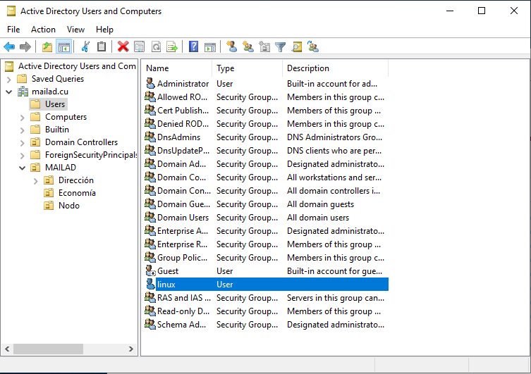
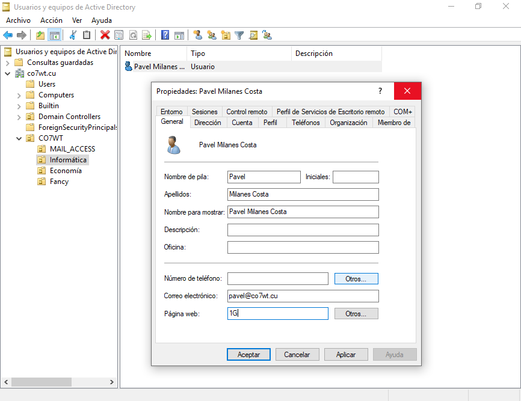

# Active Directory Requirements For This Tool

As we mentioned earlier, this tool assumes you have administrative access to a well configured Active Directory server.

We encourage the use of Samba 4 AD. The internet is full of good tutorials about how to use Samba as an AD controller; but if you are just testing MailAD then take a peek on the [Utils README](utils/README.md) for a recipe to deploy a testing Samba 4 domain.

## LDAPS Or Securing Your LDAP Communications

If you use Samba 4 you can start using secure LDAP (LDAPS) from start, you just need to specify `SECURELDAP=yes` in the `/etc/mailad/mailad.conf` file when configuring the provision.

If you need or want to run it in plain text you need to make a change in the Samba configuration (from version 4.x it defaults to LDAPS, aka: plain LDAP is disabled), to enable plain LDAP locate the [global] section on your's `/etc/samba/smb.conf` file and add this to the end of the section. Please note that you must avoid to use plain LDAP in any scenario: use LDAPS instead.

``` sh
[global]
    ... your configs ...

    # to allow to talk with the linux boxes in an insecure way (only in DMZ envs)
    ldap server require strong auth = no

```

If you use a Windows AD server then by default you need to use plain LDAP (no security); to enable LDAPS you need to read the section [Optional encryption for LDAP communications](Features.md#optional-encryption-for-LDAP-communications) in the Features.md file to know how to enable it

## RSAT (Remote Server Administration Toolkit)

To handle the user's adminstration we recommend to use a windows PC with the RSAT tools installed. Sure you can use the Command Line Interface (CLI) in linux to handle that but it's hard for newcomers, if you like to venture in that field the command is `samba-tool` and has all the options you need, but we will not cover that item here.

## Linux - AD Link

To link the Linux mail server with the AD we use a simple user (not an admin!) the default details for this user are show below:

- User name: `linux`.
- Password: `Passw0rd---` _**Warning**: `(This is the default you must change it!)`_.
- That user must be located on the `Users` default AD tree folder, NOT in the organizational OU see picture below.



## Active Directory Configuration

The active directory must be organized in a way that you have a main OU that contains all the users in the domain, in this example this OU is called `CO7WT` and inside it you can create the organization's structure that suits your needs. In my case the user "Pavel" belong to the OU "Informática" (see picture below)

You need to declare at least ONE user for admin purposes at the setup stage, in the picture below we can see a sample of it.



The only detail you need to pay attention here is the user's Email property ("Correo electrónico" in this case); for an user to be active in the mailserver you only need this:

- User active and not locked.
- Email property set and matching the domanin you are configuring.
- Optionally a specific quota for this user in the "Web Page" property ("Página Web" in this case, see the Features file for more details)
