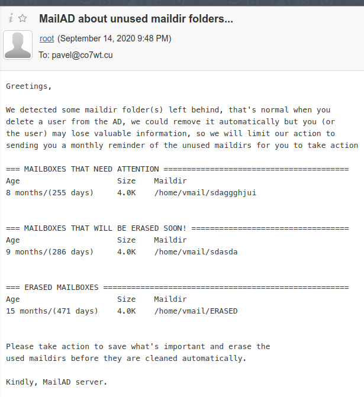

# MailAD Features Explained

This is a long page, so here is an index:

* [Low Resource Footprint](Features.md#low-resource-footprint)
* [Security Protection Against Well Known SSL And Mail Attacks](Features.md#security-protection-against-well-known-SSL-and-mail-attacks)
* [Active Directory Integration And Management](Features.md#active-directory-integration-and-management)
* [General And Specific Quota System](Features.md#general-and-specific-quota-system)
* [Daily Mail Traffic Summary](Features.md#daily-mail-traffic-summary)
* [Data From Deleted Users Is Handled With Extreme Care](Features.md#data-from-deleted-users-is-handled-with-extreme-care)
* [Let's Encrypt Certificates Support](Features.md#lets-encrypt-certificates-support)
* [Automatic Alias Using AD Groups](Features.md#automatic-alias-using-ad-groups)
* [Dovecot Filtering (Sieve)](Features.md#dovecot-filtering-sieve)
* [Advanced Mail Filtering: Extensions, Mime Types And Optional AV, SPAM And SPF](Features.md#advanced-mail-filtering-extensions-mime-types-and-optional-av-spam-and-spf)
* [Centralized Mail Storage](Features.md#centralized-mail-storage)
* [Optional SPAM Protection Extras Via DNSBL And Other Tricks](Features.md#optional-spam-protection-extras-via-dnsbl-and-other-tricks)
* [Optional Encryption For LDAP Communications](Features.md#optional-encryption-for-LDAP-communications)
* [Optional Notifications To Groups Instead Of Only The Mail Admin](Features.md#optional-notifications-to-groups-instead-of-only-the-mail-admin)
* [Optional Disclaimer On Every Outgoing Mail](Features.md#optional-disclaimer-on-every-outgoing-mail)
* [Optional Everyone List With Custom Address](Features.md#optional-everyone-list-with-custom-address)
* [Optional User Privilege Access Via AD Groups](Features.md#optional-user-privilege-access-via-ad-groups)
* [Manual Alias To Handle Typos Or Enterprise Positions](Features.md#manual-alias-to-handle-typos-or-enterprise-positions)
* [Manual Ban List For Troublesome Address](Features.md#manual-ban-list-for-troublesome-address)
* [Manual Headers And Body Check Lists](Features.md#manual-headers-and-body-check-lists)
* [Test Suite](Features.md#test-suite)
* [Raw Backup And Restore Options](Features.md#raw-backup-and-restore-options)
* [Painless Upgrades](Features.md#painless-upgrades)
* [Weekly update checks](Features.md#weekly-update-checks)

## Low Resource Footprint

This solution it's being used in production and the minimum requirements with all features are:

- RAM: 2GB
- CPU: 2 cores
- HDD: 2GB free (no email storage included, as it depends on your needs)

The most demanding feature is the SPAM & AntiVirus (AV) filtering, without that, RAM can be downgraded to 1GB. Nevertheless the actual hardware requirements depends on your mail server usage patterns and must be adjusted on the spot.

If you are willing please share some statistics and hardware details with me to update this section (hardware setup, features on, daily/monthly mail flux, etc).

[Return to index](Features.md#mailad-features-explained)

## Security Protection Against Well Known SSL And Mail Attacks

- Well known SSL/TLS vulnerabilities like LOGJAM, SSL FREAK, POODLE, etc are covered.
- Postfix and Dovecot known vulnerabilities are covered too.
- Built using best security practices.
- We will keep it updated against emerging threats: 
  - Fix for a recent spammer trick: forgery of the From/Return-Path to make the users think the mails are legitimate when they are not.
  - Ban (reject) of subject-less emails, a common spammer trick

Backed up by the collective knowledge of the [SysAdminsdeCuba](https://t.me/sysadmincuba) SysAdmins community.

[Return to index](Features.md#mailad-features-explained)

## Active Directory Integration And Management

This script is intended to provision a corporate mail server inside a DMZ and behind a perimeter mail gateway solution (I use the more recent version of Proxmox Mail Gateway).

The user basic details (email and password) are grabbed from a Windows or Samba based Active Directory (AD) server (I recommend Samba 4 on Linux). In lieu of that user management is delegated to the interface you use to control Active Directory, no other service is needed. Do NOT touch the mail server for changes related to users.

For a Windows sysadmin this will be easy, just config and deploy the mail server, then control the users in the AD interface of your PC (RSAT), see the details on the file [AD_Requirements.md](AD_Requirements.md).

If you are a Linux user then you can use `samba-tool` to manage domain users in the shell or use RSAT in a Windows virtual machine with remote access.

[Return to index](Features.md#mailad-features-explained)

## General And Specific Quota System

_**Notice:** This feature was introduced in February 2021 and if you has MailAD from an earlier version please read this first and then go to the file [Simplify_AD_config.md](Simplify_AD_config.md) to see instructions on how to migrate._

Eventually or from the very beginning you will need a quota system. Emails accumulate in user mailboxes, we propose a General and a Specific (individual or per-user basis) quota system.

### General Quota

There is a general quota declared by default for each individual user's mailbox, you can find that in the `/etc/mailad/mailad.conf` file as a variable named `DEFAULT_MAILBOX_SIZE` and it's set by default at 200 MB. So any new user will get tied to that quota with no extra config.

But what happens with that high volume users? If you need to rise the bar for some specific users... (or low it for others...):

### Specific Quota

If you need to rise (or low) the quota limit for a specific user, simply go to it's properties in the AD and set the new value in the property named "Web Page" ("Página Web" in Spanish, "wWWHomePage" ldap attribute) like in this picture for the user "Pavel" that has a specific 1G (1 GByte)  quota.


The units are standard:

- #K: KBytes like 800K
- #M: MBytes like 500M
- #G: GBytes like 1G
- #T: TBytes like 1T

There is a soft restriction here: you are not allowed to use decimals, but you can use the lower unit to get the same effect: instead of 1.5G you can say 1500M.

[Return to index](Features.md#mailad-features-explained)

## Daily Mail Traffic Summary

The account configured as the mail system administrator _(or the ones associated to the SYSADMINS group, if specified)_ will receive a (daily) mail traffic summary of the previous day. The resume is built with the pflogsumm tool.

[Return to index](Features.md#mailad-features-explained)

## Data From Deleted Users Is Handled With Extreme Care

In most mailservers when you remove a user from the system its mail storage (maildir in our case) is automatically erased. In our case we choose to act with more caution: the user's maildir will not be deleted instantly.

We will left the user's maildir intact for you to review or recover any business-critical email. You can recover the mail by re-creating the user account in the AD and login with the credentials.

Each month you will receive a mail from your mail server notifying you about left-behind maildirs, you are free to take action about them (usually making a backup and then erase the offending maildir is enough).

Here we play a trick:

- Administrators with maildirs for deleted users between 0 to 10 months (actually 9.7) will be notified to take action.
- Administrators with maildirs for deleted users between 10 to 11.999 months will be warned about imminent removal.
- Maildirs for deleted users older than 365 days (1 year) will be removed and the administrator will receive the removal notification.

Well not quite. The first time maildirs will not be removed, you just will be notified about the maildirs that _will be_ erased and the way to activate that feature.

To activate that option you need to set the option `MAILDIRREMOVAL="yes"` in the config file `/etc/mailad/mailad.conf` _(you don't have that option? it's time to upgrade... see [Painless upgrades](Features.md#painless-upgrades))_ and then re-provision the server with this command:

``` sh
make force-provision
```

We think that a year is time enough to recover something from that mailbox. Also that period of time has a legal implication: in some scenarios you are required to maintain a copy of all users digital footprint for at least one year.

Here you can see a notification sample from the first implementation of this feature:



[Return to index](Features.md#mailad-features-explained)

## Let's Encrypt Certificates Support

You can now use a Let's Encrypt certificate out of the box, just read the section [Certificate creation](INSTALL.md#certificate-creation) in the INSTALL.md file for details.

[Return to index](Features.md#mailad-features-explained)

## Automatic Alias Using AD Groups

Imagine you have a group of specialists in which all of them need to receive emails from/for a service, for example bills, vouchers, account status notifications from a bank institution, having an alias "banking@domain.tld" that points to all of them is a neat trick.

You can configure that from the AD interface, just create an Organizational Group in the AD, make all required users recipients as members of that group and set an email for the group, that's all! well, not quite.

The group checking is triggered daily around ~6:00 am, if you need to trigger it now, just run the script on `/etc/cron.daily/mail_groups_update` and that will force the update. A cron job will report any failure or warning to the declared mail administrator.

The trigger for this feature is the setting of an email for a group, once you set an email to a group you are triggering it next morning. Be aware that this feature can be exploited by malicious users as the alias created has no user control, anybody can send emails to the alias address, so use it wisely.

**Bonus:** This aliases behave not like a real distribution list (like mailman's list for example), all the generated messages have no trace of being "from" a list, and seems just like single messages from the original sender, also all answers (replies and forwarded emails) will have the original sender as recipient and not the list address.

**Tip:** The users must belong to a group directly for this feature to work properly, you can't create a group which members are other groups, that does not work.

**Warning:** It's up to you to check that you don't assign to a list an email address that was previously assigned in the `virtual_aliases` file or to a real user, if you fall in this one you will have delivery problems.

[Return to index](Features.md#mailad-features-explained)

## Dovecot Filtering (Sieve)

Dovecot filtering is supported since June 2020, you can handle local filters in your webmail or even with the mail software if you use IMAP _(don't use POP, it's not recommended for a full mail experience)_

Please note that if you uses a webmail solution then you need to configure the sieve filtering for that particular webmail. How to configure the filtering support _(also called sieve filtering or just sieve)_ support is out of the scope of this tutorial, but note that it will be TLS protected, so keep that in mind when configuring it.

In the config file `mailad.conf` there is a setting that enables the global SPAM filter, when enabled if a mail is flagged by a filter as SPAM the filter will deliver the message but to the Spam/Junk folder instead of the Inbox.

If you have clients that use POP don't use this feature as SPAM tagged mails will be delivered but not shown when receiving emails, move them to use IMAP instead.

With this feature your users will have the choice to re-route emails to their personal emails while on a business trip, create a "vacation auto-response" or simply parse an classify their emails in the webmail.

[Return to index](Features.md#mailad-features-explained)

## Advanced Mail Filtering: Extensions, Mime Types And Optional AV, SPAM And SPF

Advanced mail filtering is handled by Amavisd-new, that bring us the default filter by extensions and mime-types, by default most dangerous extensions and mime-types are baned, but you can tweak it to suffice your needs.

**Note:** The file to change that is `/etc/amavis/conf.d/20-debian_defaults` and beware that modifications to this file **will not be preserved on an upgrade**

### Optional Antivirus Protection

By default we setup ClamAV as the default AV solutions, if your server is in Cuba (uses a Cuban IP) you need to keep the option `USE_AV_ALTERNATE_MIRROR=yes` as the official updates of ClamAV are served via Cloudflare service which bans Cuban IPs due to the Embargo/Blockade of USA to our country.

The AV activation will not be instantaneous, as it needs to update the AV database (about 300MB) and that can take some time on a busy or slow internet link; a background job is set to check for AV databases updates every hour _(will generate a follow up mail to the mail admin or the sysadmins group)_ and a final mail notice upon activation.

The AV filtering is made optional and its default value is set to "no" (disabled) as it will need further configuration from you to activate it fully, to do so you must configure:

- The server must have access to a DNS server that can reach the internet.
- Allow the server to get internet access (in your firewall or a configured proxy, keep reading)

If you are behind a proxy you must setup the proxy as per the configs in the `/etc/mailad/mailad.conf` file.

**Beware!**: If your DNS is restricted to the local or enterprise network it will not work: you will receive a notice about it.

The ClamAV updates are linked to a TXT DNS record, if the server can't fetch the content of that register there will be no updates available and the system will crash between 24 to 72 hours after the failure.

### Optional SPAM Protection

By default we pass all mails by SpamAssasin a trusted spam detection utility, but you can disable it if you'd like. See the config in the `mailad.conf` file.

SpamAssassin will process and keep tracks of the mails but to squeeze the best performance of it you must allow it to get updates from the internet, for that you need:

- The server must have access to a DNS server that can reach the internet.
- Allow the server to get internet access (in your firewall or a configured proxy, keep reading)

If you are behind a proxy you must setup the proxy as per the configs in the `/etc/mailad/mailad.conf` file.

**Beware!**: If your DNS is restricted to the local or enterprise network it will not work: you will receive a notice about it.

The SpamAssasin updates are linked to a TXT DNS record, if the server can't fetch the content of that register there will be no updates available and the system will crash between 24 to 72 hours after the failure.

### Optional SPF Filtering

The Sender Policy Framework is a nice way to check for bad incoming mails, but it's only useful in a scenario where you server is facing the internet, aka: no perimeter mail gateway or smart host in between.

If your mail server is behind a perimeter mail gateway or in general is not facing the internet it's recommended to disable the SPF filtering as it can generate more trouble than solutions.

For that reason it's shipped with that option disabled by default. If you activate it be sure to have a working DNS in the server or it will not be able to process the queries.

[Return to index](Features.md#mailad-features-explained)

## Centralized Mail Storage

If you are using a virtualization solution you can configure the local mail storage as a network share and have all email in a safe storage on the network, generating clean & slim backups of that server.

**Notice**: Please make it work first on a local folder and then map the folder to a network storage, this will avoid a few headaches. If you use NFS be aware that the user id mappings need to work between the email client and the NFS server.

[Return to index](Features.md#mailad-features-explained)

## Optional SPAM Protection Extras Via DNSBL And Other Tricks

The DNSBL (DNS Black List) feature is simple: it makes postfix to consult the originating IP of incoming mail against a few free public list in the internet to decide if it accept the email. As simple as that! Of course, addresses in the `mynetworks` postfix's variable are not checked against that feature.

This lists are a curated community effort to list any offending DNS name or IP (mostly known spammers and non mail enabled networks). We use these ones:

- [zen.spamhaus.org](https://www.spamhaus.org)
- [psbl.surriel.com](https://psbl.org/)
- [bl.spamcop.net"](https://www.spamcop.net/)
- [bl.spameatingmonkey.net](https://www.spameatingmonkey.net)

As you have imagined, this is only useful if you are on a server that is facing the internet or any other NAT trick that makes your server the first to receive emails from the internet directly.

**If you have a perimeter mail gateway or are in an institutional VPN and all mail is delivered to you via a smart host or relay, then please don't enable it as it's a waste of time, CPU and bandwidth; and IT WILL CAUSE MAIL LOSS.**

As usual there is no free lunch, those free servers that are pre-configured in mailad has limits or quotas to limit the "free" usage (they have a commercial side to earn money also) the most usual pitfall is to use a very visible DNS server, so if many people use that DNS server it will trigger the quota and your service is disabled.

Usual DNSs falling in that category are Google's `8.8.8.8` & `8.8.4.4`, don't use those in any mail server that users DNSBL. Instead we recommend the use of your ISP DNS or the CloudFlare DNS server pool: `1.0.0.1` & `1.1.1.1` those are a geographical & round robin pool, so the chances to trigger the quota are low.

You can add or remove more servers to the list of DNSBL servers, even if you buy commercial support for it, just include it on the variable `DNSBL_LIST` to know more of the format, please refer to the postfix documentation about the configuration variable named "postscreen_dnsbl_sites"

Also, there is a list or other nice features to fight SPAM, all of them related to the service that makes possible the DNSBL, a list of them here:

- No pipelining is allowed.
- Pre greet message is mandatory.
- Forbids bare new line in the communication.
- Disables the verify command.
- No auth is allowed over port 25.

[Return to index](Features.md#mailad-features-explained)

## Optional Encryption For LDAP Communications

By default the MailAD provision script will use plain text LDAP communications, but you can switch to secure (encrypted) communications if you like. The instructions are different based on the Active Directory software you are using. Let's see them:

### Samba 4 AD

If you start with a fresh Samba 4 install and you have not integrated any other service you can set the `SECURELDAP=yes` option in the `/etc/mailad/mailad.conf` config file and go ahead, it will work out of the box.

If you has a previous Samba 4 server with other LDAP services integrated using plain text communicattions then you need to stick to use plain text ldap for compatibility.

See the [AD_Requirements.md](AD_Requirements.md) file for more details on how to enable plain text LDAP in Samba.

### Windows Server AD

Well, for Windows it's a bit more complicated: you need to enable the secure protocols for the LDAP service in Windows, [this article from Microsoft](https://support.microsoft.com/en-us/help/321051/how-to-enable-ldap-over-ssl-with-a-third-party-certification-authority) is the starting point of the process. Once this is done and tested, LDAP is operative with secure protocols in place (with the test described in the mentioned article).

When done just set `SECURELDAP=yes` in the config and run a `make force-provision` to activate the configuration.

[Return to index](Features.md#mailad-features-explained)

## Optional Notifications To Groups Instead Of Only The Mail Admin

Sometimes in an enterprise you have a group of sysadmins or a group of tech people that need to receive the notifications and daily email usage summaries from the mail server, by default MailAD will deliver such notifications only to the mail admin declared in the `/etc/mailad/mailad.conf` file.

From August 2020 you have the option to declare a group to get all notifications, seek for the option `SYSADMINS` in the `/etc/mailad/mailad.conf` config file, if you don't have it, that means that it's time for an upgrade, see [Painless upgrades](Features.md#painless-upgrades) for that.

In that variable you must declare a group alias email, you can create the group by two ways: 1) via text files in the mail server [by the old unix method](Features.md#manual-alias-to-handle-typos-or-enterprise-positions) or 2) by the [group mails feature](Features.md#automatic-alias-using-ad-groups) in the Active Directory, pick the one that makes you happy.

To apply this configuration you must follow this steps:

0. Upgrade, see [Painless upgrades](Features.md#painless-upgrades)
0. Create a group alias by any of the two method mentioned above, and test it (send an email to check)
0. Fill the option `SYSADMINS` in the `/etc/mailad/mailad.conf` config file.
0. Force a re-provision via `make force-provision`.

If you fail to create the group alias or make a typo in it's name or configuration, you (mail admin) will receive a daily mail with a warning about MailAD not finding the group mentioned in the `SYSADMINS` variable.

[Return to index](Features.md#mailad-features-explained)

## Optional Disclaimer On Every Outgoing Mail

Some times you need a legal disclaimer on each outgoing mail or a simple signature, or even a footer to promote an event or even a domain name change.

Now we have that covered, of course as an optional feature and disabled by default; all you need to do is this:

0. Upgrade the install as stated in the [Painless upgrades](Features.md#painless-upgrades) section _(Just the part to upgrade the config)_
0. Go to your `/etc/mailad/mailad.conf` file and change the config parameter like this `ENABLE_DISCLAIMER="yes"`.
0. Finish the upgrade to setup all the parts in place via `make upgrade`.
0. Now you have a file like this: `/etc/mailad/disclaimer.txt`, modify it as your needs.
0. If you'd like to add a disclaimer text with images create a `/etc/mailad/disclaimer.html.txt` and fill it with yours _(more on this below)_

A typical email message contains two versions of the message, one in plain text and other in hypertext _(HTML)_ to be shown in your email client. But all emails **always** have a plain text section, so the `/etc/mailad/disclaimer.txt` must always be present for it to be added, even with the HTML disclaimer present.

The default disclaimer file (`/etc/mailad/disclaimer.txt`) is added to all email in the plain text section; but if no HTML disclaimer is specified the plain text one it's added also to the HTML part, and that can lead to bad formatting.

A hypertext disclaimer that displays well must be created by you in `/etc/mailad/disclaimer.html.txt`, with proper HTML formatting _(no html or body tags; think in the content of a div)_.

If you want to include images in the HTML disclaimer they must be embedded into the text in base64 format. The easiest way to do this is by creating a mail message with the desired disclaimer (with images if required) in the body and send it to yourself. Upon receiving inspect the raw code of the email and you can copy the incumbent section to the disclaimer and test it.

With the disclaimer we can manoeuver in two ways:

- Add it to all mails originating in my domain, even when the recipient is in my domain. AKA the disclaimer will reach local users.
- Add it to mails originating in my domain and going outside of it. AKA local recipients will not see the disclaimer. 

That behavior can be controlled in the `/etc/mailad/mailad.conf` file, look below the disclaimer setting for a variable called `DISCLAIMER_REACH_LOCALS=yes`. Setting "yes" here will match the first scenario, setting "no" will match the second one.

[Return to index](Features.md#mailad-features-explained)

## Optional Everyone List With Custom Address

You have the option to enable an everyone address that has a few cool features:

- All users of the domain can send a mail to the list, but, the list address is hidden **every time**.
- Yes, the alias address is hidden, when you send a mail to it users will receive a copy of the mail coming from you, and if they reply to the email it will return only to you, so keep the "everyone" address to you and you will be safe.
- The address will not receive emails from outside the domain (by default), to avoid external access and security implications.
- You can get external access for the list as an option, check the mailad.conf file, the variable named `EVERYONE_ALLOW_EXTERNAL_ACCESS`.

[Return to index](Features.md#mailad-features-explained)

## Optional User Privilege Access Via AD Groups

In some scenarios you'd be required by law or corporate restrictions to limit a group of users to have only national (.cu) email service. It can go beyond in other cases and you could be in need of adding even users with only local domain email access.

This is now possible, it's a built-in feature. To activate it you just need to create a new Organizational Unit (OU) and two Groups inside it, the OU must be placed on the root of the LDAP search base declared.

**Warning:** The feature is linked to the OU & Group's names, so you must preserve the name, place and casing of all, AKA: _DO NOT MOVE OR RENAME IT_

The OU must be named `MAIL_ACCESS`, inside it you must create two groups called `Local_mail` & `National_mail`.

As you may guessed at this point, any user that belongs to the `Local_mail` group will have ONLY access to emails inside the domain address, the same is true for the ones belonging to the `National_mail` group but for national access. The access is instantaneous and you need no more actions.

You can take a look at this example to see how it's structured:


[Return to index](Features.md#mailad-features-explained)

## Manual Alias To Handle Typos Or Enterprise Positions

Imagine you have a user whose email is velkis@domain.tld or jon@domain.tld; when that users handle verbally his emails there is a big chance that the sender use the most common names _(belkis is very common vs velkis which is not so much, john vs jon)_ and their emails will never reach your users.

Now imagine a business card for the top positions in your enterprise, they usually set their personal emails, and that's ok, really? What if that person leaves the company? all business opportunities are lost (even more is the person leaves it in a bad way).

Now, what have this two cases in common?

Alias, I bet you can spot bouncing emails in the summaries or logs at daily basis. That "wrong" emails to "belkis" or "jhon", or to a former senior position from a big customer; what if you can change that for good?

In the first case (typos or strange/weird/uncommon names) you can simply create an alias that routes the wrong address to the good address.

In the second one (top positions business cards with personal emails) you can create an alias (or even a group of them) that points to the person real email in the position and emails will always find their way to the recipient's mailbox.

How to do that?

Just connect to the server and move to the `/etc/postfix/aliases` folder, once there edit the file `alias_virtuales` and add this lines for the typos/strange names

``` sh
belkis@domain.tld       velkis@domain.tld
john@domain.tld         jon@domain.tld
```

And this for the top positions, don't forget to convince the PR specialist about printing business cards with the aliases!

``` sh
# Director/CEO
ceo@domain.tld          ernest@@domain.tld
director@domain.tld     ernest@domain.tld
direccion@domain.tld    ernest@domain.tld

# Economy
cfo@domain.tld          lidia@domain.tld
economy@domain.tld      lidia@domain.tld
economico@domain.tld    lidia@domain.tld
economica@domain.tld    lidia@domain.tld
```

Where ernest if the CEO/Director & lidia are the CFO/Economy senior executive, if one of them changes just change the real address and keep the alias, and you will never lose a business opportunity ever.

You get it right? the business cards will be always right!

You will be tempted to make alias for a group, I know, that feature is described [here](Features.md#automatic-alias-using-ad-groups)

But, that's not all, postfix can't understand this text file! you need to compile it and instruct postfix to apply the changes, this commands does precisely that:

```sh
postmap /etc/postfix/aliases/alias_virtuales
postfix reload
```

Since June 2020 this hand crafted file is preserved on upgrades, you are welcomed to change it.

[Return to index](Features.md#mailad-features-explained)

## Manual Ban List For Troublesome Address

Yes, there is a list to put non desirable addresses, but not only addresses, you can put even users or domains, it's located on `/etc/postfix/rules/lista_negra`.

You have two options to declare an address/domain not welcomed: DROP or REJECT

- **DROP**: this is a shortcut to the trash bin, a redirection to /dev/null. It accepts the mail but trashes it immediately.
- **REJECT**: Explicitly reject the email, you can even specify an reject code and text.

The file has some examples, you can check the [list of SMTP server return codes](https://en.wikipedia.org/wiki/List_of_SMTP_server_return_codes) to learn how to respond, look for the 5XX codes, 511 is recommended.

**Warning:** You need to make a `postmap lista_negra && postfix reload` every time you change the content of the file, to generate the binary code postfix needs and to apply the change.

[Return to index](Features.md#mailad-features-explained)

## Manual Headers And Body Check Lists

### Header Checks

The header checks are stated in file: `/etc/postfix/rules/header_checks`.

This file uses regular expressions to match the content, you can match phrases on the subject line of messages and so on, the file has an example to help you build your rules.

One example for a rule is to match and reject mails from certain Mail User Agents (the software people's use to send emails) or for some version of them that are known to be deprecated and not valid.

In that file there are by now two rules to avoid spammers:

- A reject for subject-less emails
- A reject for sender/return address forgery

If you are using a MailAD dated from July 2020 please save your personal rules in that file, erase it and force a provision, that will place the newer file with the mentioned rules, then add your custom rules.

[Return to index](Features.md#mailad-features-explained)

### Body Checks

The header checks are stated in file: `/etc/postfix/rules/body_checks`.

This file uses regular expressions to match the content, you can match phrases on the body of the message. Please be aware that this will only match the text part of the message, MIME encoded messages will not match.

With some care and testing you can even filter MIME types or attachments, but the proper way of filter that content is with amavis, not here.

[Return to index](Features.md#mailad-features-explained)

## Test Suite

Since June 2020 we have a basic test suite to test our fresh provisioned server and during development as a checkpoint to know that your new feature is not breaking the security or basic features, see [Testing the mail server](tests/README.md) for more details.

[Return to index](Features.md#mailad-features-explained)

## Raw Backup And Restore Options

Raw backups?

Yes, a raw backup is a file that stores the configuration for all the services in the mail service along with SSL certificates, keys and the mailad.conf file.

To do a manual backup is simple, just move to the folder where you cloned MailAD (usually /root/mailad/ ) and just type:

``` sh
make backup
```

This will wrap up all the needed data and will place a file on the `/var/backups/mailad` with the format `YYYYMMDD_hhmmss.tar.gz`

To restore a backup yo need to switch to the MailAD folder an type on the console:

``` sh
make restore
```

And follow the options to pick one of the existent backups.

Please note that for the backup to be functional you need to have all the software in place or it will fail; that leads us to the next question:

### What if I need a backup to migrate to another server? Is that backup good for that?

There is no black magic on that, to migrate to another server you only need to do this:

0. Get sure you copied, mapped or mounted the mail storage (`/home/vmail` by default).
0. Install MailAD (see [INSTALL.md](INSTALL.md) file)
0. Copy the folder /etc/mailad with all it's contents to the new server (can be saved from a backup)
0. Adjust the variables on `/etc/mailad/mailad.conf` (hostname or so, you can fetch it from any backup file)
0. Make a "force-provision" to install MailAD with the adjusted configs.

[Return to index](Features.md#mailad-features-explained)

## Painless Upgrades

There will be a point on the future when we add a new cool feature and you want to use it, then you face the question: how to upgrade? No problem, we have it covered (again).

To upgrade the software you just need to follow this steps with an internet connection on you mail server (or access to a local repository):

0. Change dir to the folder where you keep your local clone copy of the MailAD repository `cd /root/mailad` is the default and recommended.
0. Upgrade the new code from github with the command `git pull && git reset --hard`.
0. Make a raw backup with the command `make backup` and write down the filename it shows (seriously: **WRITE IT DOWN on paper**)
0. Run the upgrade process with `make upgrade` and follow instructions if you hit some rock. This step creates a second automatic raw backup "just in case".

**Note:** _Since August 2020 we have a procedure that upgrades your custom config file to include new features, in that case you will receive a notice about the need to check the file `/etc/mailad/mailad.conf` for new options, also check the `Changelog.md` file for news about the changes and new features._

From time to time we introduce new features and probably that features need your attention or a specific configuration or tweak in your environment, if that's the case please complete the suggested steps or fixes and re-run the `make upgrade` command until it finishes ok.

If al goes well you will be the proud administrator of an upgraded MailAD instance, or not?

### GGGRRR! The upgrade failed! How do I revert the failed upgrade?

Did you wrote down the backup file name on the third step from the list above right? If not scroll up to the terminal log and search for it.

Once you have identified the file name, you just need to run the following command:

```sh
make restore
```

And follow the steps to select the proper backup file. I will wrote a (shortened) version of a successfull restore for you to see it:

```sh
root@mail:~/mailad# make restore
scripts/restore.sh
===> We found the following backups, pick one to restore:
    1)	20200922_172643
    2)	20200922_161622
    3)	20200922_161557
    4)	20200922_161543
    5)	20200922_161240
Pick the number of the backup file to restore, #1 is latest
any other value or simply an enter to abort 1
===> You selected the file:
     /var/backups/mailad/20200922_172643.tar.gz
===> Starting to restore the selected backup...
etc/postfix/
etc/postfix/postfix-files
etc/postfix/makedefs.out
etc/postfix/aliases/
[...DATA...]
etc/clamav/clamd.conf
etc/clamav/onupdateexecute.d/
etc/clamav/freshclam.conf
etc/clamav/virusevent.d/
etc/clamav/onerrorexecute.d/
Doing restart with dovecot...
● dovecot.service - Dovecot IMAP/POP3 email server
[...DATA...]
● postfix.service - Postfix Mail Transport Agent
[...DATA...]
● amavis.service - LSB: Starts amavisd-new mailfilter
[...DATA...]
● spamassassin.service
[...DATA...]
● clamav-daemon.service
[...DATA...]
● clamav-freshclam.service
[...DATA...]
===> Selected backup restored!
root@mail:~/mailad#

```

We have tested the process extensively and the chances of corruption or failure are very low. As usual in FLOSS I give only my word as warranty, make and keep backups before the upgrade to restore it in case of trouble.

[Return to index](Features.md#mailad-features-explained)

## Weekly update checks

Once in a week (as per the system cron execution schema) the system will connect to github and will check if there is a new version. If positive it will pull the changelog and compute the delta in the features and generate an email for the sysadmin or the sysadmin group.

For this feature to work you need to have internet access in the server, or in the case you specified a proxy server on the config, it will use it.

[Return to index](Features.md#mailad-features-explained)

END OF FILE