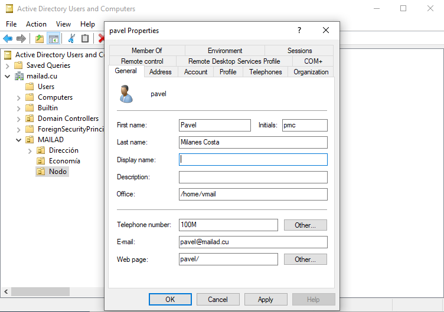

# Simplification of the Active Directory Users Configuration

Since the end of February 2020 we introduced a simplified version of AD user's properties configuration schema.

Formerly you had to setup 4 properties for a single user, a tedious task if you has many users, the properties were these (just for the record):

- E-mail: The user's email address
- Office: The general mail storage folder
- Telephone: The user's mailbox quota
- Web Page: The name for the particular user's mailbox within the general mail storage folder followed by an explicit forward slash "/")

After the Feb'2020 update you only have one mandatory and one optional field, those are:

- E-mail: The user's email address
- Web Page: **[Optional]** The user's **specific** mailbox quota

Why the quota is optional?

Simple, the general per user's quota is set now in the `/etc/mailad/mailad.conf` file as a variable named `DEFAULT_MAILBOX_SIZE` and it's set by default at 200 MB, see the section named [General and individual quota system](Features.md#general-and-individual-quota-system) in the Features.md file for more details.

## How To Migrate To This Simplified Schema If I Already Have An Old MailAD Version?

To migrate you need to read the [related explanation](utils/README.md#upgrade-to-the-simplified-ad-configuration) in the util's README file, and follow the steps there.

## Why You Changed?

- Simplicity: practice has revealed that the sysadmins or the tech people are prone to make typos or miss a field and then spend a few hours chasing their tail to find the fix.
- Productivity: think in 300 users, how many time will take to set 4 fields vs fill 1 field on those 300 users?
- User's advice: Some users was using the fields in the old schema for things on their setups, and that will rule out MailAD as a viable option.
